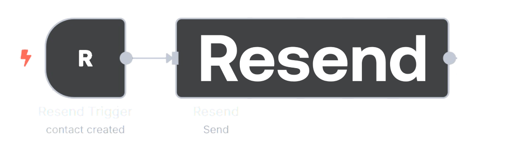

<h1 align="center">
  <br>
  <a href="/"></a>
  <br>
</h1>

# 📧 Resend Node for n8n

[](https://badge.fury.io/js/n8n-nodes-resend-revived)
[](https://opensource.org/licenses/MIT)

> **Powerful email automation for n8n using the Resend API** 🚀

Transform your email workflows with comprehensive Resend integration for n8n. Send emails, manage contacts, handle domains, and automate email campaigns with ease.

---

> [!NOTE]  
> **ReadMe:** This readme is subject to change with better docs in the upcomming week.

## 🎯 Features

- **📤 Email Operations** - Send single emails, batch emails, schedule delivery
- **📎 File Attachments** - Support for binary data and remote URL attachments
- **👥 Contact Management** - Create, update, delete contacts and audiences
- **🌐 Domain Management** - Verify domains, configure DNS settings
- **🔑 API Key Management** - Create and manage API keys programmatically
- **📢 Broadcasts** - Send newsletter campaigns to audiences
- **🎣 Webhook Support** - Receive real-time email events

---

## 🚀 Installation

### Method 1: Via n8n Community Nodes (Recommended)

[Detailed Instructions (with images)](https://docs.n8n.io/integrations/community-nodes/installation/)

1. **Open n8n Settings**
   - Navigate to **Settings** → **Community Nodes**

2. **Install the Package**
   - Click **Install a community node**
   - Enter: `n8n-nodes-resend-revived`
   - Click **Install**

3. **Restart n8n**
   - Restart your n8n instance to load the new nodes

4. **Verify Installation**
   - The **Resend** and **Resend Trigger** nodes should appear in your node palette


### Method 2: Manual Installation

```bash
# Navigate to your n8n installation directory
cd ~/.n8n

# Install the package
npm install n8n-nodes-resend-revived

# Restart n8n
# If using PM2: pm2 restart n8n
# If using Docker: docker restart n8n
# If running directly: restart your n8n process
```

### Method 3: Docker Installation


Add this to your `docker-compose.yml`:

```yaml
version: '3.8'
services:
  n8n:
    image: n8nio/n8n
    environment:
      - N8N_NODES_INCLUDE=n8n-nodes-resend-revived
    # ... other configuration
```

Or use environment variable:
```bash
docker run -it --rm \
  -p 5678:5678 \
  -e N8N_NODES_INCLUDE=n8n-nodes-resend-revived \
  n8nio/n8n
```


---

## 🔐 Credentials Setup

> [!IMPORTANT]  
> You need a Resend account and API key to use these nodes.

<details>
<summary>🔑 Configure Resend API Credentials</summary>

1. **Get Your API Key**
   - Visit [Resend Dashboard](https://resend.com/api-keys)
   - Create a new API key with appropriate permissions
   - Copy the API key (starts with `re_`)

2. **Add Credentials in n8n**
   - Go to **Credentials** → **Add credential**
   - Search for **"Resend API"**
   - Paste your API key
   - Test the connection
   - Save the credential

> [!TIP]
> Use different API keys for development and production environments

</details>

---

## 📚 Available Nodes

### 🎬 Resend Action Node

The main node for performing Resend operations.

<details>
<summary>📧 Email Operations</summary>

#### Send Email
Send individual emails with rich content and attachments.

**Key Features:**
- ✅ HTML and plain text content
- ✅ File attachments (binary data or URLs)
- ✅ CC/BCC recipients
- ✅ Custom reply-to addresses
- ✅ Email scheduling

**Example Use Cases:**
- Welcome emails for new users
- Invoice delivery with PDF attachments
- Password reset notifications
- Marketing campaigns

#### Send Batch Emails
Send up to 100 emails in a single API call for better performance.

**Key Features:**
- ✅ Bulk email sending
- ✅ Individual customization per email
- ✅ Better rate limiting
- ⚠️ No attachment support (API limitation)

#### Email Management
- **Retrieve Email** - Get email details and status
- **Cancel Email** - Cancel scheduled emails
- **Update Email** - Modify scheduled emails

</details>

<details>
<summary>👥 Contact & Audience Management</summary>

#### Contacts
- **Create Contact** - Add new contacts to audiences
- **Get Contact** - Retrieve contact information
- **Update Contact** - Modify contact details
- **Delete Contact** - Remove contacts from audiences
- **List Contacts** - Get all contacts in an audience

#### Audiences
- **Create Audience** - Set up new email lists
- **Get Audience** - Retrieve audience details
- **List Audiences** - Get all your audiences
- **Delete Audience** - Remove email lists

</details>

<details>
<summary>🌐 Domain & Infrastructure</summary>

#### Domain Management
- **Add Domain** - Register new sending domains
- **Verify Domain** - Check domain verification status
- **Get Domain** - Retrieve domain configuration
- **Update Domain** - Modify domain settings
- **Delete Domain** - Remove domains

#### API Keys
- **Create API Key** - Generate new API keys
- **List API Keys** - View existing keys
- **Delete API Key** - Revoke access keys

</details>

<details>
<summary>📢 Broadcast Campaigns</summary>

- **Create Broadcast** - Set up email campaigns
- **Get Broadcast** - Retrieve campaign details
- **Send Broadcast** - Launch email campaigns
- **Update Broadcast** - Modify campaign settings

</details>

### 🎯 Resend Trigger Node

Real-time webhook processing for email events.

<details>
<summary>📡 Supported Events</summary>

- **`email.sent`** - Email successfully sent
- **`email.delivered`** - Email delivered to recipient
- **`email.opened`** - Recipient opened the email
- **`email.clicked`** - Link clicked in email
- **`email.bounced`** - Email bounced
- **`email.complained`** - Spam complaint received
- **`contact.created`** - New contact added
- **`contact.updated`** - Contact information changed
- **`contact.deleted`** - Contact removed

</details>

---

## 💡 Usage Examples

<details>
<summary>📧 Email with Attachments Example</summary>

```yaml
# Example workflow: Send invoice email with PDF attachment
Workflow:
  1. HTTP Request Node (trigger)
  2. Code Node (generate invoice data)
  3. HTML/CSS to PDF Node (create PDF)
  4. Resend Node (send email with attachment)

Resend Node Configuration:
  - Resource: Email
  - Operation: Send
  - From: billing@yourcompany.com
  - To: {{ $json.customerEmail }}
  - Subject: Your Invoice #{{ $json.invoiceNumber }}
  - Attachments:
    - Type: Binary Data
    - Binary Property: data
    - Filename: invoice-{{ $json.invoiceNumber }}.pdf
```

</details>

<details>
<summary>🔄 Automated Email Campaigns</summary>

```yaml
# Example: Weekly newsletter automation
Workflow:
  1. Cron Trigger (weekly)
  2. Database Node (fetch newsletter content)
  3. Resend Node (create broadcast)
  4. Resend Node (send to audience)

Benefits:
  - Automated scheduling
  - Audience segmentation
  - Performance tracking
```

</details>

<details>
<summary>📊 Email Event Processing</summary>

```yaml
# Example: Handle bounced emails
Trigger: Resend Trigger Node
  - Event: email.bounced
  
Actions:
  1. Database Node (log bounce)
  2. Resend Node (remove from audience)
  3. Slack Node (notify team)
```

</details>

---

## ⚠️ Important Notes

> [!WARNING]  
> **Attachment Limitations:**
> - Maximum email size: **40MB** (including attachments)
> - Attachments **not supported** with scheduled emails or batch operations
> - Some file types may be blocked by email providers

> [!NOTE]  
> **Rate Limits:** Respect Resend's API rate limits. Use batch emails for better efficiency.

<details>
<summary>📋 API Limitations & Best Practices</summary>

### Best Practices
- ✅ Always verify your sending domains
- ✅ Use appropriate API key permissions
- ✅ Handle webhook events for better deliverability
- ✅ Implement proper error handling
- ✅ Monitor email metrics and bounce rates

### Rate Limits
- **Single emails**: Standard Resend rate limits apply
- **Batch emails**: More efficient for bulk sending
- **API calls**: Respect Resend's rate limiting

</details>

---

## 🔧 Development

<details>
<summary>🛠️ Contributing & Development Setup</summary>

```bash
# Clone the repository
git clone https://github.com/jannispkz/n8n-nodes-resend.git

# Install dependencies
npm install

# Build the project
npm run build

# Run linting
npm run lint

# Run tests
npm test
```

### Project Structure
```
├── credentials/
│   └── ResendApi.credentials.ts
├── nodes/
│   └── Resend/
│       ├── Resend.node.ts
│       ├── ResendTrigger.node.ts
│       └── icons/
└── package.json
```

</details>

---

## 🤝 Support

<details>
<summary>❓ Getting Help</summary>

- **Documentation**: [Resend API Docs](https://resend.com/docs)
- **Issues**: [GitHub Issues](https://github.com/jannispkz/n8n-nodes-resend/issues)
- **n8n Community**: [n8n Community Forum](https://community.n8n.io)
- **Discord**: [n8n Discord Server](https://discord.gg/n8n)

</details>

---

## 📄 License

This project is licensed under the MIT License - see the [LICENSE](LICENSE.md) file for details.

---

## 🙏 Acknowledgments

- Built for the amazing [n8n](https://n8n.io) workflow automation platform
- Powered by [Resend](https://resend.com) email infrastructure
- Inspired by the n8n community

---

<div align="center">

**Made with ❤️ for the n8n community**

[⭐ Star this repo](https://github.com/jannispkz/n8n-nodes-resend) | [🐛 Report Issues](https://github.com/jannispkz/n8n-nodes-resend/issues) | [💡 Request Features](https://github.com/jannispkz/n8n-nodes-resend/issues/new)

</div>
